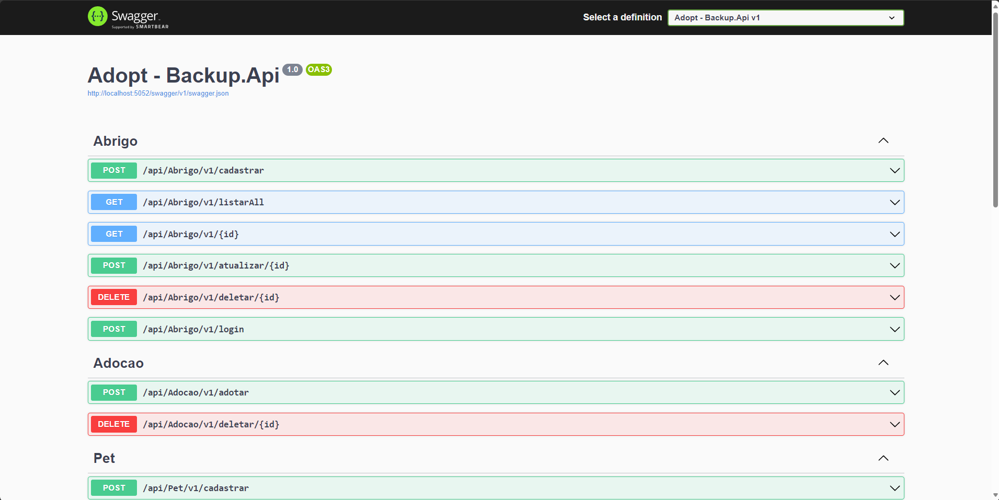

# Adopt-Pet

## Overview

A webApi that allow that you adopt a Pet Being a Tutor it also allow that you act as Shelter 
The WebApi has a Pet Photo Verification System that Check if the photo is of a Pet by means of a I.A Azure 



## Tests Automatizated

A WebApi has Tests A Automatizated Too for each  Identity

## How Test

In The Paste Adopt.Domain in the Archive FileAzure Line 10
```BlobServiceClient blobServiceClient = new BlobServiceClient("Your Key de Conexão do Azure Storage");```
replace ``` Sua Chave de Conexão do Azure Storage ``` for your Azure Storege Key

you can see how create a Azure Storege Key bellow
[How Create The Key](https://www.bing.com/ck/a?!&&p=3b296f6d3d87c014JmltdHM9MTcwODU2MDAwMCZpZ3VpZD0wNGU0MWVkZi1kMWRkLTYwYWMtMzllMy0wZDIyZDAyNjYxNWMmaW5zaWQ9NTUyMA&ptn=3&ver=2&hsh=3&fclid=04e41edf-d1dd-60ac-39e3-0d22d026615c&psq=Como+criar+um+AzureBlob+storage&u=a1aHR0cHM6Ly9sZWFybi5taWNyb3NvZnQuY29tL3B0LWJyL2F6dXJlL3N0b3JhZ2UvYmxvYnMvcXVpY2tzdGFydC1zdG9yYWdlLWV4cGxvcmVyIzp-OnRleHQ9SW4lQzMlQURjaW8lMjBSJUMzJUExcGlkbyUzQSUyMFVzYXIlMjBvJTIwR2VyZW5jaWFkb3IlMjBkZSUyMEFybWF6ZW5hbWVudG8lMjBkbyx1bWElMjBBc3NpbmF0dXJhJTIwZGUlMjBBY2Vzc28lMjBDb21wYXJ0aWxoYWRvJTIwLi4uJTIwTW9yZSUyMGl0ZW1z&ntb=1)
```after go to The Archive Visionia.cs in the line 38 client.DefaultRequestHeaders.Add("Ocp-Apim-Subscription-Key", "Your Key");```
replace ```Your Key``` For your SubcribedKey
[See How Here](https://www.bing.com/ck/a?!&&p=f1565e7f6cf9e00fJmltdHM9MTcwODU2MDAwMCZpZ3VpZD0wNGU0MWVkZi1kMWRkLTYwYWMtMzllMy0wZDIyZDAyNjYxNWMmaW5zaWQ9NTQ4Nw&ptn=3&ver=2&hsh=3&fclid=04e41edf-d1dd-60ac-39e3-0d22d026615c&psq=Como+criar+uma+conta+Vision+Studio&u=a1aHR0cHM6Ly9sZWFybi5taWNyb3NvZnQuY29tL3B0LXB0L2F6dXJlL2FpLXNlcnZpY2VzL2NvbXB1dGVyLXZpc2lvbi9vdmVydmlldy12aXNpb24tc3R1ZGlvIzp-OnRleHQ9Q3JpZSUyMHVtYSUyMFN1YnNjcmklQzMlQTclQzMlQTNvJTIwZG8lMjBBenVyZSUyMHNlJTIwYWluZGElMjBuJUMzJUEzbyxQb2RlJTIwaWdub3JhciUyMGVzdGUlMjBwYXNzbyUyMGUlMjBmYXolQzMlQUEtbG8lMjBtYWlzJTIwdGFyZGUu&ntb=1)

For Test is onlyne execute The Command 
```Dotnet Run```
In The Paste Adopt.Api or
Open The Archive Adopt.Sln and Run the archive Adopt.Api

